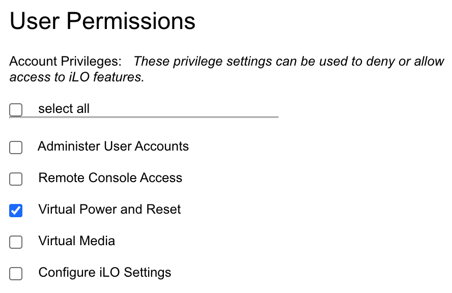
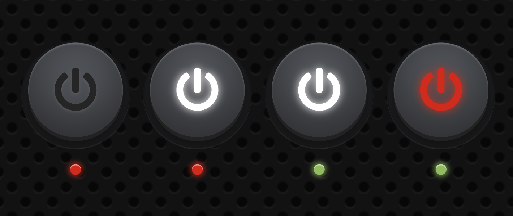

<!-- Improved compatibility of back to top link: See: https://github.com/othneildrew/Best-README-Template/pull/73 -->
<a name="readme-top"></a>


<!-- PROJECT LOGO -->
<br />
<div align="center">
  <a href="https://github.com/tr4cks/power">
    
  </a>

  <h3 align="center">Power 🦸‍♀️ One click, One button</h3>

  <p align="center">
    All-in-one tool for remote server power control
  </p>
</div>

<br />

[](https://github.com/tr4cks/power/blob/main/LICENSE)

---


<!-- TABLE OF CONTENTS -->
<details>
  <summary>Table of Contents</summary>
  <ol>
    <li><a href="#about-the-project">About The Project</a></li>
    <li>
      <a href="#getting-started">Getting Started</a>
      <ul>
        <li><a href="#prerequisites">Prerequisites</a></li>
        <li>
          <a href="#installation">Installation</a>
          <ul>
            <li><a href="#ilo-configuration">ilo configuration</a></li>
            <li><a href="#wol-configuration">wol configuration</a></li>
          </ul>
        </li>
      </ul>
    </li>
    <li>
      <a href="#usage">Usage</a>
      <ul>
        <li><a href="#gui">GUI</a></li>
        <li><a href="#command-line">Command Line</a></li>
        <li><a href="#api">API</a></li>
        <li><a href="#apple-shortcuts">Apple Shortcuts</a></li>
        <li><a href="#discord">Discord</a></li>
      </ul>
    </li>
    <li><a href="#contributing">Contributing</a></li>
    <li><a href="#enhancements">Enhancements</a></li>
    <li><a href="#license">License</a></li>
    <li><a href="#credits">Credits</a></li>
  </ol>
</details>


<!-- ABOUT THE PROJECT -->
## About The Project

This easy-to-use project is designed to control the switching on and off of a server through a web interface. As it's easy to install and consumes few resources, you can deploy it on a first-generation Raspberry Pi. This can enable you to control your home server simply, while consuming a little less energy.

This project also makes it possible to bypass the technical restrictions preventing the broadcasting of a magic packet (WOL) within the internal network over a VPN.

*❗️ Please note that this service is not intended (for the moment) to be deployed directly on the Internet, but is for internal use only. To access it externally, please use a secure way to connect such as through a VPN, Authelia...*


<!-- GETTING STARTED -->
## Getting Started

### Prerequisites

Start by getting the application binary either by downloading a release from GitHub or by building it using the following commands:

```shell
GOOS=linux GOARCH=arm GOARM=6 go build
```

*❕ This command is suitable for first-generation Raspberry Pi. Be sure to modify the operating system and architecture to suit your target.*

### Installation

To start with, here's how to easily launch the server. No need to import `html` or `css` files, a simple configuration file is all you need:

```shell
power -m wol --config config.yaml
```

Currently, two modules are available:
  * `ilo`: use of HP iLO technology integrated into ProLiant range servers. This module enables the server to be switched on and off with a complete display of its status.
  * `wol`: use Wake-on-LAN to start the server. This module only allows the server to be started, and has a restricted display of
  the server status.

*❗️ The `ilo` module has only been implemented and tested based on the `iLO4` API, and is therefore probably not compatible with other major versions. Don't hesitate to start an issue or a pull request if you're interested in other versions.*

As we saw above, the server needs a configuration file in order to be launched. Configuration files contain 2 mandatory fields, common to all modules: `username` and `password`.

```yaml
username: username
password: password
```

These identifiers are used to restrict access for server shutdown.

Depending on the selected module, configurations may differ. For this reason, a `module` field may need to be defined, containing all the configuration specific to each module.

Now let's move on to the configuration of all the different modules:

#### `ilo` configuration

Four additional parameters must be defined for this module:
  * `hostname`: use to ping your server
  * `url`: the url to your `iLO` interface
  * `username`: the username used to log in to your `iLO` interface
  * `password`: the password used to log in to your `iLO` interface

```yaml
username: username
password: password
module:
    hostname: server.home # can also be an ip address
    url: ilo.home
    username: ilo_username
    password: ilo_password
```

*❕ Note that the action performed to shut down the server simulates pressing the power button. It is therefore up to you to ensure that pressing the power button on your server will shut it down gracefully.*

For security reasons, it is recommended to create a specific `iLO` user with the sole permission to switch the server on and off.

Under `Administration` > `User Administration`, create a new user and check only the `Virtual Power and Reset` permission.

<p align="center">
  
</p>

#### `wol` configuration

Two additional parameters must be defined for this module:
  * `hostname`: use to ping your server
  * `mac`: your server's mac address

```yaml
username: username
password: password
module:
    hostname: server.home # can also be an ip address
    mac: "42:42:42:42:42:42"
```

---

Once the configuration is complete, you need to install the web application as a daemon.

```shell
cp power /usr/local/bin
mkdir /etc/power.d
cp config.yaml /etc/power.d
PORT=8080 USER=your_user GROUP=your_group envsubst < power@.service > /etc/systemd/system/power@.service
```

*❗️ You'll need to choose which rights and permissions to set, depending on the user you choose. Of course, running the web application as root is not recommended.*

If you want to use ports below `1024` for the web application when running it with a non-root user, you need to add capacity to it. The capability we need to add is `CAP_NET_BIND_SERVICE`, which is explicitly defined as the capacity for an executable to bind to a port less than `1024`.

You need to be root to do that, so first, be root. Then, add the capability to the `power` binary:

```shell
setcap cap_net_bind_service=+ep /usr/local/bin/power
```

You can check that the capability has been added with:

```shell
getcap /usr/local/bin/power
```

And use setcap again, to remove the capability:

 ```shell
 setcap cap_net_bind_service=-ep /usr/local/bin/power
 ```

*❗️ With this setup, any nonprivileged user can now run `power` on privileged ports. So, be very careful about what you do. Additionally, you can further restrict execution of the `power` binary, either using standard credentials (chmod, chown et al) or, even better, ACLs.*

Another method is to redirect traffic from port 80 to port 8080 using NAT, but this will not be covered here.

Once all the files have been copied, you can activate and start the service corresponding to the desired module.

For the `ilo` module:

```shell
systemctl enable power@ilo.service
systemctl start power@ilo.service
```

For the `wol` module:

```shell
systemctl enable power@wol.service
systemctl start power@wol.service
```

Finally, all you have to do now is open your browser, type in the address corresponding to the `power` application, and start your server by pressing the button with all your might 👊

<p align="right">(<a href="#readme-top">back to top</a>)</p>


<!-- USAGE -->
## Usage

### GUI

<div align="center">
  
</div>

Depending on the module used, the server status display may differ.

In fact, the `ilo` module only displays a green LED if the server responds to an ICMP request (ping), and the button is alight from the moment the server is switched on, whether or not it responds to the ICMP request.

On the other hand, the `wol` module displays the green LED and turns on the button light only when the server responds to an ICMP request (ping).

If an error occurs when you press the button, it will turn red and you can view the logs with the following command:

```shell
sudo journalctl -u power@my_module.service
```

*❕ As the page is not reactive, it must be reloaded to update and view the current server state.*

### Command Line

It is also possible to use this tool from the command line. There's no point in instantiating it as a daemon if you only want to use it that way.

Three commands are available:
  * `up`: starts the server
  * `down`: turns off the server
  * `state`: provides server status in JSON format

Since the `ilo` module simulates the pressing of the power button, regardless of whether it is to switch the server on or off, it is advisable to check the status of the server before carrying out such an operation.

For example, if you want to create an entry in your `crontab` to start the server while checking that it's not already running, you can use the following command:

```crontab
SHELL=/bin/bash

0 20 * * * [ "$(/usr/local/bin/power -m ilo state 2> /dev/null | jq -r '.power == false and .led == false')" = "true" ] && /usr/local/bin/power -m ilo up
```

*❕ The previous command requires the `jq` utility to run.*

Concerning the `wol` module, as mentioned earlier, it does not allow you to shut down the server, so the `down` command will have no effect.

### API

An api is available to create `shortcuts` easily on `iOS`, for example.

Three routes are available:

#### `/api/up`

This endpoint is used to start the server.

**Method:** `POST`

**Response on success:**

Status code: `200`

Body:

```json
{
  "status": "ok"
}
```

**Response on error:**

Status code: `500`

Body:

```json
{
  "status": "ko",
  "error": "..."
}
```

#### `/api/down`

This endpoint is used to shutdown the server.

This route requires authentication using `Basic Auth`. For information on how to use `Basic Auth`, please refer to this [documentation](https://en.wikipedia.org/wiki/Basic_access_authentication).

**Method:** `POST`

**Response on success:**

Status code: `200`

Body:

```json
{
  "status": "ok"
}
```

**Response on error:**

Status code: `500`

Body:

```json
{
  "status": "ko",
  "error": "..."
}
```


#### `/api/state`

This endpoint is used to retrieve the server state.

**Method:** `GET`

**Response on success:**

Status code: `200`

Body:

```json
{
  "power": true,
  "led": true
}
```

---

Since the `ilo` module simulates the pressing of the power button, regardless of whether it is to switch the server on or off, it is advisable to check the status of the server before carrying out such an operation.

Concerning the `wol` module, as mentioned earlier, it does not allow you to shut down the server, so the `down` command will have no effect.

### Apple Shortcuts

This project includes three Apple Shortcuts that let you easily control your **local server** from your iPhone, iPad, or Mac.

| 🧩 Shortcut Name | 📝 Description | 🔗 Link |
|-----------------------------|----------------|--------|
| 🟢 **Power on the server** | Starts the local server | [Download](https://www.icloud.com/shortcuts/e32561b02b3142ab9f7ce60919442423) |
| 🧠 **Server status** | Displays the current status of the local server (online or offline) | [Download](https://www.icloud.com/shortcuts/7627ba326db344daa3ee3f20e03620c0) |
| 🔴 **Power off the server** | Gracefully shuts down the local server | [Download](https://www.icloud.com/shortcuts/edeaa53c4f564ab181d4558aa716375b) |

> 💡 These shortcuts rely on the **power’s API** to work.  
> Each action sends an HTTP request to the API.

### Discord

In addition to the HTTP server, you can also activate a Discord bot to manage the server with commands from Discord. The following commands are available:

- `/server_status`: Provides the current status of the server.
- `/power_on`: Turns the server on.
- `/power_off`: Turns the server off.

To enable this functionality, simply add the following fields to the configuration file:

```yaml
discord:
  bot-token: your_bot_token
  guild-id: "your_guild_id" # optional
```

*❗️ To shut down the server, you must be a Discord server administrator.*

<p align="right">(<a href="#readme-top">back to top</a>)</p>


<!-- CONTRIBUTING -->
## Contributing

This project has been designed to easily add internal modules. Just make sure it meets a generic need and not a personal one. For example, creating a module for executing command lines could be a good starting point.

So don't hesitate to launch a pull request to create a module that could be useful to the community.

<p align="right">(<a href="#readme-top">back to top</a>)</p>


<!-- ENHANCEMENTS -->
## Enhancements

The possibility of adding external modules via the [go-plugin](https://github.com/hashicorp/go-plugin) library or a shared library could be an interesting idea.

Feel free to open issues to suggest improvements.


<!-- LICENSE -->
## License

Distributed under the MIT License. See `LICENSE.txt` for more information.

<p align="right">(<a href="#readme-top">back to top</a>)</p>


<!-- CREDITS -->
## Credits

* Thanks to the author of this [article](https://www.hongkiat.com/blog/css3-on-off-button/) on [Hongkiat](https://www.hongkiat.com/blog/) for the button design
* [Power icons created by Uniconlabs - Flaticon](https://www.flaticon.com/free-icons/power)

<p align="right">(<a href="#readme-top">back to top</a>)</p>
